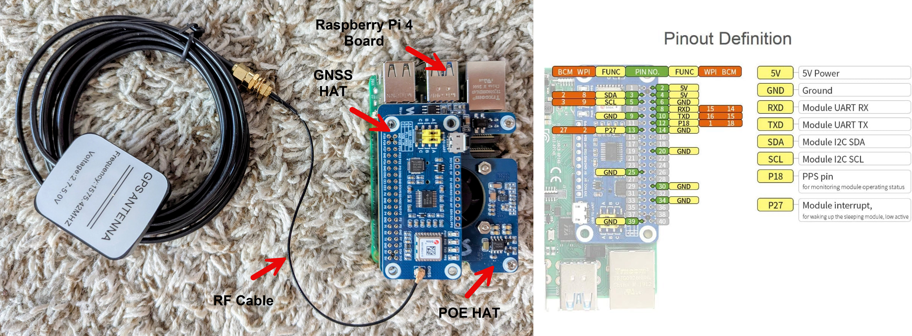

# Raspberry Pi Stratun 1 NTP Server with GPS & PPS

## Clock Synchronization

In distributed systems, accurate clock synchronization is important for maintaining consistency across devices. It ensures logs, timestamps, and time-sensitive operations are properly ordered and verifiable. Without synchronization, discrepancies can lead to failed security checks, inconsistent metrics, and debugging nightmares.

Regular clock synchronization is necessary to ensure that all devices in a network or system maintain a consistent and accurate sense of time. Even high-quality clocks can drift over time due to factors like temperature changes, aging components, environmental interference, and power supply variations. Regular synchronization corrects these deviations and maintains accurate time.

## Network Time Protocol (NTP)

NTP is a networking protocol designed to synchronize clocks over packet-switched, variable-latency data networks (like the Internet or LAN). It adjusts system clocks gradually, avoiding abrupt changes. NTP uses client-server model, where a NTP client requests time information from a NTP server to synchronize its clock. The latest version of NTP is NTPv4, as specified in RFC 5905. This document provides comprehensive details on the operation of NTP, including its architecture, packet structure, and synchronization mechanisms.

### NTP Time Sources

NTP uses a hierarchical system of time sources. Each level is called a `stratum`, with Stratum 0 being the highest quality time source. Stratum 1 servers are directly connected to Stratum 0 devices, Stratum 2 servers synchronize with Stratum 1 servers, and so on. A server synchronized to a stratum `n` server runs at stratum `n + 1`. The number represents the distance from the reference clock and is used to prevent cyclical dependencies in the hierarchy.

The hierarchical structure distributes the load of time requests across multiple levels. Stratum 1 servers handle fewer direct client requests, delegating most of the synchronization work to Stratum 2 and lower-stratum servers. By spreading out the synchronization responsibilities, the network avoids bottlenecks and ensures that time requests are handled efficiently.

Stratum 0 are high-precision timekeeping devices such as atomic clocks, GNSS or radio clocks. They generate an accurate Pulse Per Second (PPS) signal that triggers an interrupt and timestamp on a connected computer. Stratum 0 devices are also known as reference clocks. These devices are not directly connected to the network but used by Stratum 1 servers.

### NTP Servers

NTP servers are owned and operated by a variety of organizations, including government agencies, educational institutions, research organizations, private companies, and individual volunteers.

NIST (National Institute of Standards and Technology) is an agency in the U.S. Department of Commerce. It was founded in 1901 and is one of the nation's oldest physical science laboratories. NIST operates a set of NTP servers that provide highly accurate time derived from atomic clocks. These servers are part of the NIST Internet Time Service and are widely used for timekeeping. The NIST NTP servers are known for their high accuracy, reliability, and security. NIST also offers secure NTP (SNTP) servers that use authentication to ensure the integrity of the time information. You can find a list of NIST NTP server [here](https://tf.nist.gov/tf-cgi/servers.cgi).

Many universities run their own NTP servers for academic and research purposes such as MIT, Stanford, and Berkely.

    time.mit.edu
    time.stanford.edu
    ntp1.net.berkeley.edu
    ntp.gsu.edu

MIT NTP is a stratun 2 server:

```bash
ntpdate -q time.mit.edu

server 18.7.33.13, stratum 2, offset +0.002546, delay 0.14195
18 Apr 04:42:42 ntpdate[296]: adjust time server 18.7.33.13 offset +0.002546 sec
```

It synchronizes with three internal stratum-1 servers, each using GNSS as their reference clock:

```bash
ntpq -p time.mit.edu

     remote           refid      st t when poll reach   delay   offset  jitter
==============================================================================
+oc11-755-clock- .GNSS.           1 u  380 1024  377    1.637   -0.094   0.078
*w92-clock-1.mit .GNSS.           1 u  364 1024  377    1.451   -0.150   0.170
+m24-clock-1.mit .GNSS.           1 u  418 1024  377    1.285   -0.116   0.024
```

Stanford, on the other hand, runs a small pool of NTP servers behind the `time.stanford.edu` hostname.

```bash
ntpdate -q time.stanford.edu

server 171.64.7.105, stratum 2, offset +0.000445, delay 0.06184
server 171.64.7.73,  stratum 2, offset +0.001827, delay 0.05075
server 171.64.7.67,  stratum 1, offset +0.000244, delay 0.05147
18 Apr 04:43:03 ntpdate[297]: adjust time server 171.64.7.67 offset +0.000244 sec
```

ntpdate queried all of them, compared their stratum, offset, and delay.

It chose 171.64.7.67 (the stratum 1 server) as the best source to sync with.

Many companies like Google, Facebook, Apple, Microsoft, and Cloudflare operate NTP servers to support their services and the wider Internet community.

    time.google.com
    time.facebook.com
    time.apple.com
    time.windows.com
    time.cloudflare.com
    ntp.ubuntu.com

The NTP Pool is a large cluster of time servers providing accurate time synchronization services. The [NTP Pool Project](https://www.ntppool.org/en/), managed by volunteers, aggregates these servers into a pool and distributes requests among them. This setup enhances redundancy, load balancing, and reliability. When you configure your devices to use the NTP Pool, they are automatically directed to a random set of servers from the pool, ensuring even distribution of requests.

### NTP Precision and Clock Resolution

NTP operates with a timestamp format that has a precision of 2^32 seconds, which is approximately 233 picoseconds. However, this level of precision is not typically achievable in real-world scenarios due to the following reasons:

- System Clock Resolution:

    The resolution of the local system clock affects how finely time can be measured.
    
    Most modern operating systems have clock resolutions in the microsecond (μs) range, far less precise than 233 picoseconds. 

- Processing Delay:

    Delays within the client and server computers as they process NTP packets can introduce errors.
    
    Interrupt handling, context switching, and other system activities add to these delays. 

- Network Latency:

    The time it takes for packets to travel between NTP servers and clients can introduce delays and variability.
    
    Network congestion, routing paths, and the physical distance between devices affect synchronization precision.

- Jitter:

    Jitter is variations in packet travel times. It can cause fluctuations in time measurements.
    
    NTP algorithms attempt to minimize jitter, but it cannot be entirely eliminated.

In real-world applications, the achievable precision of NTP is typically within tens of microseconds in LAN and within a few milliseconds in WAN. This is because, in LAN, devices are physically closer to each other, often within the same building or campus. This proximity results in lower network latency and low jitter.

Also programming languages and their standard libraries might have limitations when it comes to representing and storing time. These limitations can arise from the underlying data types, precision, and range supported by the language. For example, the highest precision that Python’s built-in datetime module can support is microseconds.

You can retrieve the precision and clock resolution (among other technical details) of a remote NTP server. This is feasible only if that server allows remote queries via NTP control messages (Mode 6 packets). MIT NTP server has precision of -20 which means the clock can resolve time to approximately 2^(-23) seconds ≈ 119 nanoseconds.

```bash
ntpq -c rv time.mit.edu

associd=0 status=06f4 leap_none, sync_ntp, 15 events, freq_mode,
version="ntpd 4.2.2p1@1.1570-o Fri Dec 19 18:27:47 UTC 2014 (1)",
processor="x86_64", system="Linux/2.6.18-308.13.1.el5", leap=00,
stratum=2, precision=-20, rootdelay=1.612, rootdispersion=22.283,
peer=49422, refid=18.1.67.13,
reftime=ebac6701.e97ac7b1  Fri, Apr 18 2025  5:52:01.912, poll=10,
clock=ebac68e3.e6dd9b2f  Fri, Apr 18 2025  6:00:03.901, state=4,
offset=-0.179, frequency=+0.827, jitter=0.070, noise=0.098,
stability=0.000, tai=0
```

So the smaller (more negative) the number, the more precise the server.

## Local NTP Server

A local NTP server is a device running an NTP daemon (`ntpd`, `chronyd`, etc.) that provides time synchronization to other devices on the same network. Running a NTP server inside your local home network is a powerful way to gain control over time synchronization for your devices.

You can configure a local NTP server to synchronize with a public stratum 1 NTP server, making your system a stratum 2 server. Once configured, this local server can provide accurate time synchronization to all devices within your home or lab network. This architecture offers several advantages:

- Reduced Latency: Devices within the local network synchronize with millisecond-level accuracy, reducing jitter and improving time precision.
- Timestamp Consistency: Ensures that all devices use a common time source, which is critical for log correlation, automation workflows, backup scheduling, and distributed processing.
- Support for Offline Networks: Works well in air-gapped or security-sensitive networks.
- Network Efficiency: Reduces unnecessary external NTP queries by centralizing synchronization, which is particularly useful in networks with many devices.

## Using GNSS as a Time Source

For even greater accuracy and independence, we can configure a NTP server to use a GNSS module as its time source. These modules often provide a Pulse Per Second (PPS) signal in addition to NMEA data, enabling the server to align its clock with sub-microsecond accuracy. When an NTP server is directly synchronized to a GNSS receiver, it is considered to be operating at stratum 1 — one level below the actual stratum 0 reference.

Using a GNSS time source for a local NTP server offers multiple benefits compared to relying solely on public NTP servers:

- High Accuracy (Sub-microsecond): GNSS receivers with PPS provide extremely accurate timing, far superior to internet-based NTP sources.
- Low Latency & Jitter: Time is derived locally, avoiding variable network delays and congestion common with public NTP servers.
- No Internet Dependency: Time sync remains fully functional even if your internet connection is lost — ideal for offline, secure, or isolated networks.
- Supports Air-Gapped Environments: Essential for military, industrial, or secure facilities where public network access is restricted or forbidden.

## Raspberry Pi GNSS Module

I am using the MAX-M8Q GNSS module, integrated as a HAT (Hardware Attached on Top) for the Raspberry Pi. This module connects via the GPIO header and extends the system’s functionality by providing accurate satellite-based time and positioning data.

| **Feature**                   | **Specification**                                                     |
|-------------------------------|-----------------------------------------------------------------------|
| **GNSS Supported**            | GPS, GLONASS, Galileo, BeiDou, QZSS                                   |
| **Concurrent GNSS**           | Up to 3 systems concurrently                                          |
| **Channels**                  | 72 tracking channels                                                  |
| **Position Accuracy (CEP)**   | ~2.0 m (with SBAS), ~1.5 m with good antenna                          |
| **Update Rate**               | Up to 10 Hz                                                           |
| **Sensitivity**               | Acquisition: –148 dBm, Tracking: –167 dBm                             |
| **Time to First Fix (TTFF)**  | `Cold Start`: 26s, `Warm Start`: 25s, `Hot Start`: 1s                 |
| **Assisted GNSS**             | u-blox AssistNow Online, Offline, Autonomous                          |
| **Antenna Interface**         | U.FL connector for external antenna (active/passive supported)        |
| **PPS Output**                | Yes, 1 Pulse Per Second (configurable)                                |
| **Interfaces**                | UART, I²C, SPI                                                        |
| **Supply Voltage**            | 1.65 V to 3.6 V (typically 3.3 V)                                     |
| **Power Consumption**         | ~25 mA (continuous tracking)                                          |
| **Backup Battery Support**    | Yes, for RTC and ephemeris data (e.g., CR1220 coin cell)              |
| **Operating Temperature**     | –40 °C to +85 °C                                                      |
| **Dimensions**                | ~10.1 × 9.7 × 2.5 mm (module only)                                    |
| **Protocols Supported**       | NMEA, UBX (u-blox proprietary), RTCM                                  |
| **Configuration Tool**        | u-center (Windows GUI from u-blox)                                    |
| **RoHS Compliant**            | Yes                                                                   |
| **Ideal Applications**        | IoT, drones, robotics, vehicle tracking, precision timing             |

The MAX-M8Q GNSS module has four LEDs:

| **LED Label**              | **Meaning**                                                               |
|----------------------------|---------------------------------------------------------------------------|
| **PWD (Power)**            | `ON`: The module is powered and running.                                  |
| **RXD**                    | `ON`/`Flashing`: Module is receiving data from the host (Raspberry Pi).   |
|                            | `OFF`: No incoming serial data from Pi to GPS module (normal if idle).    |
| **TXD**                    | `Blinking`: Module is sending NMEA data (like GPS sentences) to the Pi.   |
| **PPS (Pulse Per Second)** | `Blinking once per second`: GPS has a valid fix (i.e., position lock).    |
|                            | `OFF`: No satellite fix yet.                                              |

## Wiring and Device Detection

The hardware configuration is like the following:



The GNSS antenna interface on the MAX-M8Q GNSS module is connected to an external GPS antenna via a RF adapter cable.

The small end of the cable has U.FL (also known as IPEX or MHF1) connector and connects to the GNSS module.

The larger end of the cable has SMA female connector and connects to the external GPS antenna.

The external GPS antenna is securely mounted on a window to ensure optimal satellite reception.

Once the GNSS module and external GPS antenna are connected, power on the Raspberry Pi.

If everything is functioning correctly, the PPS LED will begin blinking.

This indicates that the module has successfully acquired a valid GNSS fix.

In other words, it has locked onto a sufficient number of satellites to determine accurate position and time.

## Enabling and Verifying PPS Signal

Device `/dev/pps0` represents the PPS source.

It is created by pps-gpio overlay, typically tied to a GPIO pin receiving the 1Hz PPS signal from a GNSS module.

Open the /boot/firmware/config.txt file.

Make sure UART is enabled:

    enable_uart=1

The PPS from our GNSS HAT is connected to GPIO 18. Enable it by:

    dtoverlay=pps-gpio,gpiopin=18,capture_clear

Reboot the system to apply changes:

```bash
sudo reboot
```

Check the GPIO information:

```bash
sudo apt install gpiod
sudo gpioinfo | grep pps

line  18:     "GPIO18"     "pps@12"   input  active-high [used]
```

This confirms that GPIO18 is currently configured as an input pin, labeled "pps@12", and it is actively being used.

Install pps-tools package:

```bash
sudo apt update
sudo apt install -y pps-tools
```

To confirm the PPS signal is being received, run:

```bash
sudo ppstest /dev/pps0
```

You should see time-stamped PPS output approximately once per second, indicating successful synchronization.

## Disabling Serial Console Access

Check if any process is already using the /dev/ttyS0 device:

```bash
sudo apt install lsof
```

```bash
sudo lsof /dev/ttyS0

COMMAND  PID USER   FD   TYPE DEVICE SIZE/OFF NODE NAME
login   4290 root    0u   CHR   4,64      0t0  601 /dev/ttyS0
login   4290 root    1u   CHR   4,64      0t0  601 /dev/ttyS0
login   4290 root    2u   CHR   4,64      0t0  601 /dev/ttyS0
```

login is the program that prompts for username and password when accessing the system via a terminal or serial console. It is typically started by systemd or getty services for TTYs (like /dev/ttyS0). Since login is using /dev/ttyS0, it blocks the GNSS software from accessing the UART.

Disable the serial login shell:

```bash
sudo systemctl disable serial-getty@ttyS0.service
sudo systemctl stop serial-getty@ttyS0.service
```

Confirm it's gone:

```bash
sudo lsof /dev/ttyS0
```

The serial login shell on /dev/ttyS0 may get re-enabled after a reboot.

Edit the kernel boot parameters to remove references to the serial console.

```bash
sudo nano /boot/firmware/cmdline.txt
```

Look for and remove this part (if present):

    console=serial0,115200

Make sure the whole line becomes a single line with no line breaks. Save and exit.

A faster way to do this is through raspi-config:

```bash
sudo raspi-config
```

Choose Interfacing Options -> Serial -> No -> Yes

## Reading Raw GNSS Data via UART

You can quickly inspect the raw NMEA output from your GNSS module using the cat command:

```bash
sudo cat /dev/ttyS0
```

If the GNSS module is active and functioning, you should see standard NMEA sentences like:

    $GPGGA,...
    $GPRMC,...

This is a simple, non-interactive way to verify that data is being received on the serial interface.

For a more robust and interactive serial interface, you can use minicom.

```bash
sudo apt install minicom
```

Launch minicom with the correct baud rate (e.g., 9600):

```bash
sudo minicom -b 9600 -D /dev/ttyS0
```

To exit minicom: Press Ctrl+A, then X, then press Enter.

## Setting up gpsd

gpsd is a service daemon that interfaces with GPS hardware devices and provides location, time, and velocity data to client applications over a standardized TCP/IP interface.

- gpsd reads data from GNSS receivers (typically via serial interfaces)
- Interprets NMEA sentences or binary protocols
- Makes the parsed data available to programs such as cgps, ntpd, or chronyd

This enables multiple clients to simultaneously access GPS information without directly handling low-level serial communication. This makes gpsd a central hub for GPS data on Linux systems.

Install gpsd package:

```bash
sudo apt update
sudo apt install -y gpsd gpsd-clients
```

Add the current user into dialout group:

```bash
sudo usermod -a -G dialout $USER
```

Edit `/etc/default/gpsd` to look like the following:

    # Start the gpsd daemon automatically at boot time
    START_DAEMON="true"

    # Devices gpsd should collect data from at boot time.
    DEVICES="/dev/ttyS0 /dev/pps0"

    GPSD_OPTIONS="--listenany --nowait --badtime --passive --speed 9600"

    # Use USB hotplugging to add new USB devices automatically to the daemon
    USBAUTO="true"

Then enable and restart the service:

```bash
sudo systemctl enable gpsd
sudo systemctl restart gpsd
```

To display position fix data (latitude, longitude, time, altitude, speed, etc.) and a live satellite view:

```bash
cgps -s
```

It includes satellite IDs, signal strengths, and whether each satellite is used in the current fix.

To check PPS signal timing:

```bash
gpsmon
```

## Setting up chrony

Chrony is a versatile and efficient implementation of the Network Time Protocol (NTP). It is used to synchronize the system clock with time sources such as NTP servers, GPS receivers, or local reference clocks.

Designed for systems with intermittent network connectivity or variable latency, Chrony offers fast and accurate time correction, making it ideal for embedded systems like Raspberry Pi. It supports a wide range of reference clocks, including GNSS modules via NMEA and PPS signals, and can adapt quickly to changes in system clock behavior.

Install chrony package:

```bash
sudo apt update
sudo apt install -y chrony
```

Create a new configuration file:

```bash
sudo nano /etc/chrony/conf.d/stratum1.conf
```

With this content:

```text
###############################################################################
# 1. Basic Configuration
###############################################################################

# Drift file: tracks frequency offset of the system clock
driftfile /var/lib/chrony/chrony.drift

# Key file for NTP authentication (optional unless using authenticated clients)
keyfile /etc/chrony/chrony.keys

# Directory to write log files
logdir /var/log/chrony

# Lock chronyd into RAM to reduce latency (only works on Linux)
lock_all

# Synchronize system clock with RTC every 11 minutes
rtcsync

# Read hardware clock configuration
hwclockfile /etc/adjtime

# Allow chronyd to appear synchronized even without a real upstream (used in GPS-only setups)
local orphan

# Allow clients on your network to sync with this NTP server
allow

###############################################################################
# 2. Time Correction and Clock Stepping
###############################################################################

# Step the clock if the offset is > 0.2s, any time (no limit on number of steps)
makestep 0.2 -1

# Prevent bad measurements from skewing system clock
maxupdateskew 100.0

###############################################################################
# 3. GPS + PPS Reference Clock Configuration (via gpsd)
###############################################################################

# SHM(0): NMEA data only (less precise)
refclock SHM 0 refid GPS0 precision 1e-1 poll 3 offset 0.0 noselect

# SHM(1): GPS + PPS combined (best source)
refclock SHM 1 refid PSM0 precision 1e-7 poll 3 trust prefer

# PPS from /dev/pps0, kernel timestamped
refclock PPS /dev/pps0 refid PPS0 precision 1e-7 poll 3 trust noselect lock PSM0

# gpsd socket (optional backup if SHM is not used)
refclock SOCK /var/run/chrony.pps0.sock refid PST0 precision 1e-7 poll 3 trust noselect

###############################################################################
# 4. Public NTP Pool Fallback Servers (used if GPS fails)
###############################################################################

# NTP pool for fallback time sources
pool pool.ntp.org iburst minpoll 4 maxpoll 4
pool 2.debian.pool.ntp.org iburst minpoll 4 maxpoll 4

# Example stratum-1 NTP servers (optional)
#server ntp1.example.com iburst minpoll 4 maxpoll 4
#server ntp2.example.com iburst minpoll 4 maxpoll 4

###############################################################################
# 5. Logging Configuration
###############################################################################

# Enable detailed logging for analysis and calibration
log tracking measurements statistics refclocks

# Disable periodic column headers in log files
logbanner 0

# Log if system clock changes by more than this threshold (in seconds)
logchange 0.1

###############################################################################
# 6. Optional: Temperature Compensation (for Raspberry Pi CPU)
###############################################################################

# Apply temp compensation using CPU temperature sensor
# Syntax: tempcomp <sensor_path> <coefficient_ppm_per_degC> <log_file>
# tempcomp /sys/class/thermal/thermal_zone0/temp 8 /etc/chrony/chrony.tempcomp
```

Restart the service:

```bash
sudo systemctl restart chrony
```

List sources:

```bash
chronyc sources -v
```

## gpsdclient Python

gpsdclient is a Python package that connects as a client to the GPSD daemon. It enables programs to receive real-time GNSS data (such as position, velocity, and time) over a local or network socket using the GPSD protocol.

You can install the package via pip:

```bash
pip3 install gpsdclient
```

```python
import json
from gpsdclient import GPSDClient

# get your data as json strings:
with GPSDClient(host="127.0.0.1") as client:
    for result in client.json_stream():
        data = json.loads(result)
        print(data)
```

It establishes a connection to the gpsd on default port 2947 and sends watch commands to enable streaming.

The code then receives the response in json format.

Each message includes a class key to indicate the type of report.

This key helps the client understand how to interpret the rest of the data.

| Class      | Description                                                                  |
|------------|------------------------------------------------------------------------------|
| `VERSION`  | Reports GPSD version, revision, and protocol version.                        |
| `DEVICES`  | Lists all connected GPS devices and their metadata.                          |
| `DEVICE`   | Describes a single GPS device and its configuration/status.                  |
| `WATCH`    | Acknowledges the client watch command; controls data streaming.              |
| `SKY`      | Satellite information: visibility, signal strength, and usage in fix.        |
| `TPV`      | **Time-Position-Velocity** report with GPS fix, time, coordinates, speed.    |
| `GST`      | GPS pseudorange error statistics (e.g., standard deviations).                |
| `ATT`      | Device attitude (pitch, roll, yaw) for devices that support it (e.g., AHRS). |
| `TOFF`     | Time offset data between system clock and GPS time.                          |
| `PPS`      | PPS (Pulse Per Second) timing signal report (used for high-precision time).  |
| `AIS`      | Report containing decoded AIS (Automatic Identification System) data.        |
| `RTC`      | Real-Time Clock data from devices that support it.                           |

You can find more detailed information in here:

https://www.mankier.com/5/gpsd_json

This allows developers to build GPS-aware applications without handling low-level serial communication or raw NMEA parsing.

You can use the `gpsdclient` standalone program to print TPV data in a tabular format.

```bash
gpsdclient

Connected to gpsd v3.25
Devices: /dev/ttyS0

Mode | Time                 | Lat          | Lon            | Track  | Speed  | Alt    | Climb    
-----+----------------------+--------------+----------------+--------+--------+--------+----------
3    | 2025-04-14 07:37:35  | 37.913388333 | -122.059022333 | n/a    | 0.537  | 31.2   | 0.0      
3    | 2025-04-14 07:37:36  | 37.913391333 | -122.059022    | n/a    | 0.503  | 31.4   | 0.2      
3    | 2025-04-14 07:37:37  | 37.913389833 | -122.0590105   | n/a    | 0.22   | 31.4   | 0.0      
3    | 2025-04-14 07:37:38  | 37.913383833 | -122.059005333 | n/a    | 0.091  | 31.6   | 0.2      
3    | 2025-04-14 07:37:39  | 37.9133765   | -122.059013833 | n/a    | 0.096  | 31.3   | -0.3  
```